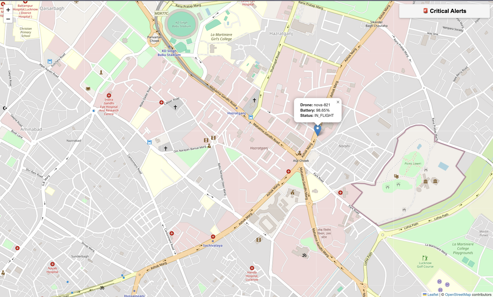

# Project Nova: Real-Time Drone Fleet Command Center


Project Nova is a complete, event-driven system that simulates, tracks, and monitors a fleet of autonomous delivery drones in real-time. Built using Apache Kafka as its central nervous system, this project demonstrates a scalable, decoupled architecture perfect for IoT and real-time data processing applications.

The system ingests a high-volume stream of drone telemetry data, processes it to detect critical events (like low battery or geofence breaches), and displays the entire fleet on a live, interactive map for a human operator.

---

## 📸 Final Product

Here is the live command center dashboard in action, showing a drone in flight and a critical alert that has been automatically detected and displayed.




---

## 🧠 Core Concepts Learned

This project provides hands-on experience with the following key concepts:

-   **Kafka Fundamentals**: Topics, Producers, Consumers, and Brokers.
-   **Scalable Consumption**: Implementing and understanding Consumer Groups for distributing workloads.
-   **Decoupled Architecture**: Building independent services that communicate solely through Kafka.
-   **Real-Time Stream Processing**: Using the **Consume -> Process -> Produce** pattern to derive insights from a raw data stream.
-   **Full-Stack Integration**: Bridging a backend Kafka pipeline with a live web UI using Flask and WebSockets.
-   **Infrastructure as Code**: Using Docker and Docker Compose to define and launch the entire Kafka cluster reliably.

---

## 🏛️ System Architecture

The system is composed of several independent services that communicate via two main Kafka topics: `drone-telemetry` for high-volume location data and `drone-alerts` for low-volume, high-importance events.


---

## ✨ Features

-   **Real-Time Drone Simulation**: A Python script simulates drones with realistic movement and battery drain.
-   **Live Map Visualization**: A web dashboard built with Leaflet.js displays all drones on a map, updating their positions in real-time.
-   **Automated Alerting**: A dedicated service monitors all telemetry data and generates alerts for:
    -   **Low Battery**: When a drone's battery drops below 20%.
    -   **Geofence Breach**: When a drone flies outside of its designated operational area.
-   **Decoupled & Scalable**: Each component (drone, alerting service, dashboard) is a separate process, allowing them to be scaled independently.

---

## 🛠️ Tech Stack

-   **Backend**: Python, Flask, Flask-SocketIO, kafka-python
-   **Frontend**: HTML, CSS, JavaScript, Leaflet.js, Socket.IO
-   **Infrastructure**: Apache Kafka, Zookeeper, Docker, Docker Compose
-   **Monitoring UI**: Kafdrop (Web UI for Kafka)

---

## 🚀 Getting Started

Follow these instructions to get the project up and running on your local machine.

### Prerequisites

You must have the following installed:
-   [Python 3.8+](https://www.python.org/downloads/)
-   [Docker](https://www.docker.com/products/docker-desktop/)
-   [Docker Compose](https://docs.docker.com/compose/install/) (usually included with Docker Desktop)

### 1. Clone the Repository

```bash
git clone https://github.com/sachinchandra2022/project-nova.git
cd project-nova
```

### 2. Set Up the Python Environment
It is highly recommended to use a virtual environment.
```bash
# Create a virtual environment
python3 -m venv venv

# Activate it (macOS/Linux)
source venv/bin/activate

# Or activate it (Windows)
# .\venv\Scripts\activate

# Install the required Python packages
pip install -r requirements.txt
```

### 3. Launch the Kafka Infrastructure

This command will start Kafka, Zookeeper, and the Kafdrop UI in the background.
```bash
docker-compose up -d
```

You can verify that the Kafka cluster is running by visiting the Kafdrop UI at http://localhost:9000.

### 4. Run the Application
You need to run the three Python services in three separate terminals. Make sure you have activated the virtual environment (source venv/bin/activate) in each terminal.

#### Terminal 1: Start the Drone Simulator
```bash
python drone_simulator.py
```
#### Terminal 2: Start the Alerting Service
```bash
python alerting_service.py
```
#### Terminal 3: Start the Web Server & Dashboard Backend
```bash
python command_center_v2.py
```


### 5. View the Command Center
Open your web browser and navigate to:
    http://127.0.0.1:5000
You should now see the live map with a drone moving and alerts appearing as they are triggered!

## 📁 Project Structure
```bash
project-nova/
├── static/
│   └── style.css           # CSS for the dashboard
├── templates/
│   └── index.html          # HTML for the dashboard
├── .gitignore
├── command_center_v2.py    # The web server and dashboard backend
├── alerting_service.py     # The stream processing service for alerts
├── drone_simulator.py      # Simulates a single drone's telemetry
├── docker-compose.yml      # Defines the Kafka infrastructure
├── README.md               # This file
└── requirements.txt        # Python dependencies